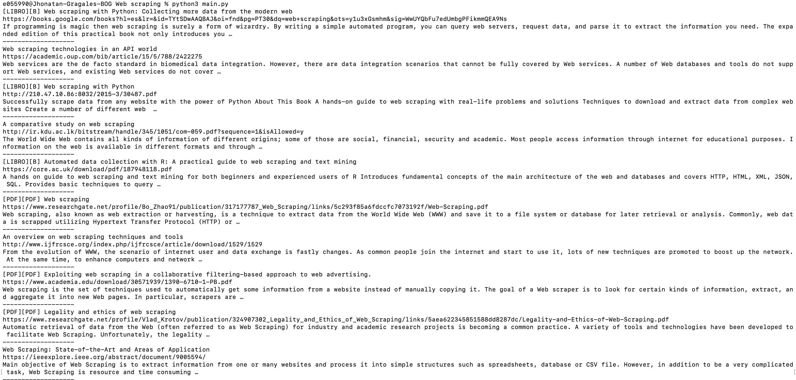

# Instrucciones de instalacion

A continuación se muestran las instrucciones para la instalación y ejecucion

Si ya cuentas con Pyton instalado, ve a [Libreria request](#libreria-request)

## Configurar la consola por defecto - solo para MacOS

Desde la consola ejecutar:

```
chsh -s /bin/zhs
```

## Verificar la version de Python
Desde la consola ejecutar:
```
python --version
```

## Instalar homebrew - solo MacOS
Gestor de paquetes para MacOS

Desde la consola ejecutar:
```
/bin/bash -c "$(curl -fsSL https://raw.githubusercontent.com/Homebrew/install/HEAD/install.sh)"
```


# Instalar Python
Se puede hacer con cualquier gestor de instalacion de paquetes, en este caso se usa brew para MacOS
Desde la consola ejecutar:
```
brew install python
```

## Solo requerido en MacOS
Ir al directorio principal
```
cd ~
```

Crear un archivo vacio para hacer python3 por defecto
```
vim .zshrc
```

Agregar la siguiente linea
```
export PATH="/usr/local/opt/python/libexec/bin:$PATH"
```

Salir del archivo con :wp

Reiniciar la consola y ejecutar
```
python
```


## Proxy para que Google no bloquee nuestra IP por hacer multiples solicitudes a su pagina
Crear una cuenta en [Proxies API](https://app.proxiesapi.com/index.php)
De alli obtienes un KEY, se debe usar en el siguiente comando usando el valor de KEY del sitio anterior y reemplazando la URL de Google Scholar

Desde la consola ejecutar:
```
curl "http://api.proxiesapi.com/?auth_key=XXXXXXXXXXXXXXXXXXXXX&url=https://scholar.google.com/"
```

# Libreria request
Desde la consola ejecutar:
```
pip install requests
```


## Instalar BeautifulSoup framework de webscraping 
Desde la consola ejecutar:
```
pip install beautifulsoup4
```

# Ejecucion
Descargar el archivo main.py, ir al directorio que lo contiene y correr el comando
```
python3 main.py
```

El resultado deseado debe ser algo asi:
